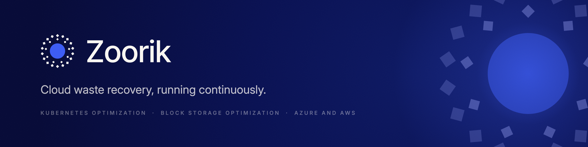

<p align="center">
  <a href="https://zoorik.com"></a>
</p>

<p align="center">
  Two products that cut your cloud bill while your systems keep serving.
  <br>
  <a href="https://zoorik.com"><b>Website</b></a>&nbsp;&nbsp;·&nbsp;&nbsp;<a href="https://zoorik.com/assessment"><b>Free assessment</b></a>&nbsp;&nbsp;·&nbsp;&nbsp;<a href="https://cal.com/zoorik/talk"><b>Book a demo</b></a>
</p>

<br>

<table>
  <tr>
    <td width="50%" valign="top">
      
      <h3>Coral</h3>
      <b>Kubernetes optimization</b><br>
      <sub>Supported on AKS and EKS · Compatible with your native Karpenter, NAP and Autoscaler</sub>
      <ul>
        <li><b>Monitoring</b>: cost tracked always, every action logged</li>
        <li><b>Recommendations</b>: right sizes, spare nodes and the saving</li>
        <li><b>Workload optimization</b>: CPU and memory requests sized to real use</li>
        <li><b>Node optimization</b>: spare nodes drained one at a time; never creates machines</li>
      </ul>
      <a href="https://zoorik.com/coral">Product page</a>&nbsp;&nbsp;·&nbsp;&nbsp;<a href="https://zoorik.com/coral/guide">Product guide</a>
    </td>
    <td width="50%" valign="top">
      
      <h3>Amoeba</h3>
      <b>Block storage optimization</b><br>
      <sub>Supported on Windows and Linux</sub>
      <ul>
        <li><b>Monitoring</b>: used and provisioned space on every disk</li>
        <li><b>Savings insights</b>: what each VM costs, and what you save</li>
        <li><b>Block storage optimization</b>: expands and shrinks online, one disk at a time</li>
      </ul>
      <a href="https://zoorik.com/amoeba">Product page</a>&nbsp;&nbsp;·&nbsp;&nbsp;Coming soon: <a href="https://cal.com/zoorik/talk">book a demo for early access</a>
    </td>
  </tr>
</table>

<table>
  <tr>
    <td width="25%" valign="top"><b>Cut cost</b><br><sub>Pay for what your workloads use, not what was provisioned for the peak.</sub></td>
    <td width="25%" valign="top"><b>Safe by design</b><br><sub>Nodes drain one at a time. A disk leaves the pool only when it is empty.</sub></td>
    <td width="25%" valign="top"><b>Reliable</b><br><sub>No code changes. Resizes happen while you keep serving.</sub></td>
    <td width="25%" valign="top"><b>Full visibility</b><br><sub>You decide what each product manages, and see every change it makes.</sub></td>
  </tr>
</table>

### Find your own number

One line in your cloud console. One Excel file with your estimated saving at list price. There is no upload and no telemetry; you send the file yourself.

```bash
curl -fsSL https://zoorik.com/assess/k8s | python3 -     # Kubernetes (AKS and EKS)
curl -fsSL https://zoorik.com/assess/disks | python3 -   # Azure disks (Linux VMs)
```

<sub>Read the code first in <a href="https://github.com/Zoorikcloud/assessment">Zoorikcloud/assessment</a>, or follow the steps at <a href="https://zoorik.com/assessment">zoorik.com/assessment</a>.</sub>

<details>
<summary><b>Connect a cluster to Coral with <code>zoorikctl</code></b></summary>
<br>

| Platform | Install |
|---|---|
| macOS | `brew tap zoorikcloud/tap && brew trust zoorikcloud/tap && brew install zoorikctl` |
| Windows | `irm https://get.zoorik.com/windows.ps1 \| iex` |
| Linux | `curl -fsSL https://get.zoorik.com/linux \| sh` |

Then run the `zoorikctl cluster connect` command from the Coral console's "Connect cluster" dialog. Its connect token works once and expires after 60 minutes.

</details>

<details>
<summary><b>Public repositories</b></summary>
<br>

| Repository | What it is |
|---|---|
| [assessment](https://github.com/Zoorikcloud/assessment) | The free assessment scripts |
| [zoorikctl](https://github.com/Zoorikcloud/zoorikctl) | The command that connects a Kubernetes cluster to Coral: releases and installers |
| [homebrew-tap](https://github.com/Zoorikcloud/homebrew-tap) | Homebrew tap for zoorikctl |
| [scoop-bucket](https://github.com/Zoorikcloud/scoop-bucket) | Scoop bucket for zoorikctl |

</details>

<br>

<p align="center">
  <a href="https://zoorik.com">zoorik.com</a>&nbsp;&nbsp;·&nbsp;&nbsp;<a href="mailto:founders@zoorik.com">founders@zoorik.com</a>&nbsp;&nbsp;·&nbsp;&nbsp;<a href="https://www.linkedin.com/company/zoorik">LinkedIn</a>&nbsp;&nbsp;·&nbsp;&nbsp;<a href="https://www.youtube.com/@zoorikcloud">YouTube</a>&nbsp;&nbsp;·&nbsp;&nbsp;<a href="https://x.com/Zoorikcloud">X</a>&nbsp;&nbsp;·&nbsp;&nbsp;<a href="https://www.reddit.com/r/zoorik">Reddit</a>&nbsp;&nbsp;·&nbsp;&nbsp;<a href="https://medium.com/zoorik">Medium</a>
  <br>
  <sub>Zoorik Private Limited · Bengaluru, India · <a href="https://zoorik.com/privacy">Privacy policy</a></sub>
</p>
